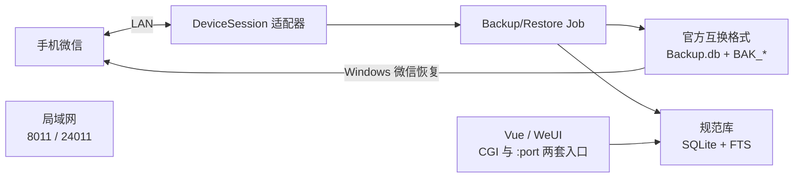
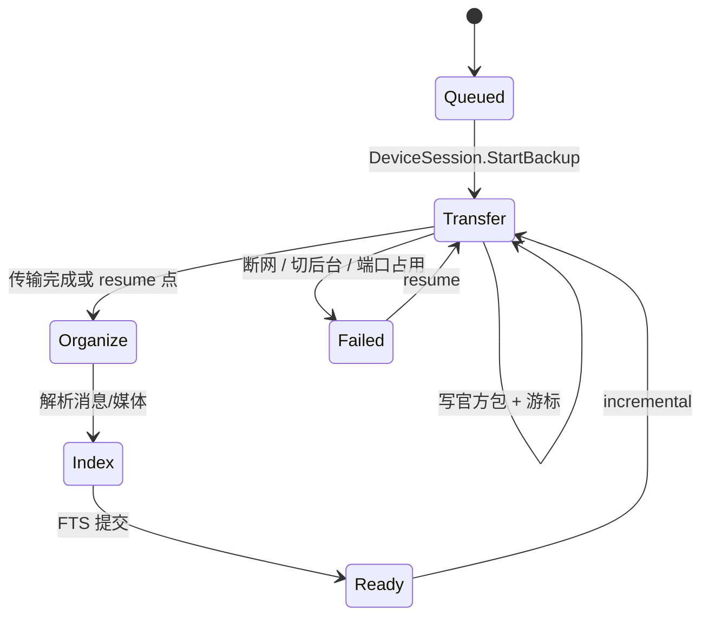

# NAS 微信备份系统独立重建计划

> 日期：2026-09-12  
> 依据：公开 README、fnOS FPK 元数据、Go/Vite 字符串与前端 API 面  
> Case：`work/wxbackup-rebuild/`  
> 性质：**清洁室架构重建**。实现同等用户功能，不复制付费二进制、不移植微信电脑协议实现、不实现会员校验绕过。

## 1. 目标与非目标

### 目标

在用户自己的 NAS 上提供与微备份（WxBackup）**同类**的能力：

1. 把鸿蒙 / iOS / Android 微信聊天记录备份到 NAS。
2. 浏览器离线查看、搜索、导出。
3. 全量 / 增量备份，中断后续传。
4. 把备份恢复到手机（官方格式兼容优先）。
5. 先以飞牛 fnOS `.fpk` 交付，Docker 为第二发布面。

### 非目标

- 不从 `WxBackup` ELF 中提取或重放微信 Mac/iPad 协议栈。
- 不实现、不绕过对方的 `/api/products`、`/api/pay`、年费绑定。
- 不把 Windows/macOS 微信本地库当默认数据源（对方也未做，issue #92/#100）。
- 不自动/定时备份（对方未实现；可作为后续可选）。
- 不对微信生产服务器做未授权测试。

### 授权与数据边界

只处理**用户自己的微信账号、自己的 NAS、自己的手机**。备份流量走局域网。聊天内容默认只落在用户指定目录。

## 2. 从产品描述还原出的系统

公开文档已经把主路径说死了：NAS 上先扫码登录成一台“电脑微信”，再走微信官方的“备份到电脑 / 恢复到手机”。FPK 与二进制字符串把这个描述钉成了可实现的模块边界。



### 观察到的运行时（仅作对照，不照搬）

| 层 | 观察 | 重建选择 |
|----|------|----------|
| 包 | fnOS gzip+tar `.fpk`，`appname=WxBackup`，`service_port=20365`，root | 同样走 fnpack；端口可配 |
| 主进程 | 剥离符号的 Go ELF，cgo sqlite，Go 1.21 痕迹 | Go 1.22+ |
| CGI | 另一个 Go `index.cgi` 做飞牛 iframe 入口 | 薄反向代理 / 静态托管 |
| 前端 | Vite + Vue + Pinia + WeUI/Vant；`dist/cgi` 与 `dist/port` | 同一套 SPA，两种 base |
| 浏览器自动化 | 无头 Chromium / CDP，用于滑块 | 仅 Web 登录适配器需要 |
| 媒体 | 静态 ffmpeg + silk/pcm 转换 | ffmpeg 边车 |
| 搜索 | bleve `search.index` | SQLite FTS5（默认）或 bleve |
| 账号元数据 | `/var/apps/WxBackup/var/dbs/global.db` | `meta.db` |
| 官方格式 | `Backup.db`、`BAK_N_TEXT`、`BAK_N_MEDIA` | 作为**恢复导出格式** |
| 会员 | `/api/pay`、外部 :20360 | **删除** |

## 3. 关键决策

### D1. DeviceSession 必须是可替换适配器

对方把微信电脑协议、二维码、ECDH 握手、备份心跳、无头浏览器滑块打进同一个 41MB Go 进程。这是产品能跑通的原因，也是不能直接复制的部分。

重建把“如何在手机眼里变成一台电脑”收口成接口：

```go
type DeviceSession interface {
    LoginQR(ctx context.Context) (LoginSession, error)
    WaitLoggedIn(ctx context.Context) (Account, error)
    StartBackup(ctx context.Context, req BackupRequest) (BackupStream, error)
    StartRestore(ctx context.Context, req RestoreRequest) (RestoreStream, error)
    RefreshContacts(ctx context.Context) error
    Close(ctx context.Context) error
}
```

第一期只实现 **Sidecar 适配器**：在 NAS 旁路跑官方电脑微信（KVM/Windows 容器或用户本机微信），用 UI 自动化触发“备份/恢复”，把官方产出的 `Backup.db` 收进规范库。协议适配器（独立、基于用户自己的 LAN PCAP）放到后续 PR，且不得从本仓库的 FPK 反编译移植。

### D2. 单一规范存储，官方格式按需导出

对方同时保留加密官方包和明文查看库，所以同样 40GB 手机数据会变成约 100GB（issue #78）。重建默认：

- **规范库**（可检索、可渲染）是唯一真相。
- **官方互换格式**只在“恢复到手机 / 交给 Windows 微信”时生成。
- 若用户勾选“保留官方包以便随时恢复”，再打开双写。

### D3. 增量用 per-session 游标，不用全局字节偏移

`wx_backup_history(talkerId, endTime, segment_meta, get, total)` 说明断点是按会话走的。Job 状态机按 `talker_id + last_msg_seq/end_time + segment_meta` 持久化。

### D4. 应用端口可配，微信端口不可配

`8011`、`24011` 是微信官方发现/传输口。Docker 必须 `network_mode: host` 或等价。`20360-20367`、`9014`、`20365` 在重建里改成配置项，避免和飞牛其他应用抢端口。

### D5. 前端一套代码，两个入口

飞牛桌面走 iframe + CGI 路径前缀；H5 / Docker 走根路径。用 Vite `base` 打出 `web/dist/cgi` 与 `web/dist/port`。

### D6. 不做会员系统

备份次数、账号绑定、支付回调全部不进入代码。需要商业化时另开 billing 模块，不复用对方的控制面。

### D7. 语言与运行时

- 后端：Go（与 NAS 静态部署、cgo sqlite、ffmpeg exec 匹配）。
- 前端：Vue 3 + Pinia + WeUI/Vant（与现有交互心智接近，但独立实现）。
- 搜索：FTS5 先做；数据量到亿级消息再评估 Tantivy/bleve。
- 媒体：ffmpeg 转换语音/视频；图片按消息 XML 中的 md5 寻址。

## 4. 仓库布局

```text
wxbackup/
  cmd/
    server/          # HTTP API + 静态资源
    cgi/             # fnOS index.cgi 反向代理
    worker/          # backup/restore/index 队列（可与 server 同进程）
  internal/
    domain/          # Account Session Conversation Message Media Job
    app/
      account/
      backup/
      restore/
      viewer/
      search/
      export/
    adapter/
      devicesession/
        sidecar/     # 官方客户端边车（默认）
        capture/     # 自有设备 PCAP 驱动的协议适配器（后期）
      backupfmt/     # Backup.db + BAK_* 读写
      media/         # ffmpeg / silk
    store/
      sqlite/
      fts/
    http/            # chi/echo 路由，DTO
  web/               # Vue SPA
  deploy/
    fnos/            # manifest, cmd/*, ui/config, wizard
    docker/
  testdata/
    fixtures/        # 合成聊天，不含真实用户数据
  docs/
```

## 5. 领域模型

```text
Account          一个微信账号在本 NAS 上的投影
  wxid, nickname, avatar, login_state, backup_root, access_pwd_hash

DeviceSession    当前电脑登录态（适配器持有，不入库明文协议密钥）

BackupJob
  id, account_id, mode=full|incremental|resume
  status=queued|transfer|organize|index|done|failed|cancelled
  bytes_in, sessions_done, error

RestoreJob
  id, account_id, selector=all|session_ids
  status=...

Conversation
  account_id, talker_id, kind=friend|group|oa|wecom
  display_name, avatar, last_msg_time, msg_count

Message
  account_id, talker_id, msg_id, msg_seq, msg_type
  is_send, create_time, text, xml, extra jsonb

MediaObject
  account_id, media_id, kind, sha256, path, size, available

BackupCursor     增量游标
  account_id, talker_id, last_end_time, segment_meta, received, total
```

消息类型按 README 已支持集合建渲染器，每种一个文件：

文本、图片、视频、语音、文件、链接、小程序、名片、位置、GIF、表情、引用、合并、红包（未领取）、转账、系统消息、视频号、视频号直播、群接龙、群公告、礼物。

明确不做：公众号通知、音视频通话。

## 6. HTTP 合同（独立实现，语义对齐产品，不拷路径版权）

对外合同按资源划分。实现时路径可以与观察面相近，以便对照测试，但 handler 与 DTO 全部自写。

| 资源 | 方法 | 作用 |
|------|------|------|
| `/v1/accounts` | GET/POST | 多账号 |
| `/v1/accounts/{id}/login` | POST | 取二维码 |
| `/v1/accounts/{id}/login/events` | GET SSE | 扫码/滑块/成功 |
| `/v1/accounts/{id}/backup` | POST | 开始全量/增量/续传 |
| `/v1/accounts/{id}/backup/{job}` | GET/DELETE | 进度 / 取消 |
| `/v1/accounts/{id}/restore` | POST | 恢复所选会话 |
| `/v1/conversations` | GET | 会话列表，过滤好友/群/公众号/企微 |
| `/v1/conversations/{id}/messages` | GET | 按时间/类型分页 |
| `/v1/search` | GET | 全文 + 类型过滤器 |
| `/v1/media/{id}` | GET | 文件流；缺文件返回 404 + “未点开/已过期” |
| `/v1/export` | POST | zip / 单文件 |
| `/v1/settings` | GET/PUT | 备份路径、访问密码 |
| `/v1/stats` | GET | 会话数、消息数、类型分布 |

登录必须先走桌面 Web（对方限制：首次不可在 H5）。H5 只允许已有账号的二次登录。

## 7. 备份状态机



阶段文案对齐用户习惯：传输中 → 整理数据 → 更新索引。手机微信必须前台、同 Wi-Fi、无 VPN，这些作为 Job 前置检查写进 API 错误码，而不是静默失败。

鸿蒙失败模式（跳到备份页后立刻“备份已被取消”）优先检查 `8011/24011` 占用。

## 8. 官方互换格式

Windows 微信恢复教程要求目录内存在：

```text
Backup.db
BAK_0_TEXT  BAK_0_MEDIA
BAK_1_TEXT  BAK_1_MEDIA
...
```

公开分析（Backup.db 为 SQLCipher；`MsgSegments` 指向 TEXT 分片，`MsgMedia`/`MsgFileSegments` 指向 MEDIA 分片）足够支撑**写出可被官方客户端识别的包**，密钥派生必须来自当前 DeviceSession，而不是硬编码。

`internal/adapter/backupfmt` 提供：

- `Writer`：从规范库导出官方包（恢复路径）。
- `Reader`：从官方包导入规范库（Sidecar 路径；用户从 Windows 微信拷来的包也可导入）。

没有会话密钥时 Reader 只建立会话列表，不假装能解密正文。

## 9. 前端信息架构

页面与 README 截图对齐，独立实现：

1. 账号首页：登录、备份、恢复、删除、会员位删除。
2. 备份设置：路径、会话勾选、访问密码。
3. 备份/恢复进度。
4. 聊天查看器：会话列表、消息流、类型过滤、搜索、导出、刷新头像。
5. 统计：消息数、类型分布；年度回顾可放二期。
6. 设置 / 帮助 / 日志反馈（本地日志，不强制上传）。

深色模式：`data-weui-theme` 切换。桌面与 H5 共用组件，首次登录在 H5 显示“请到 NAS 桌面完成”。

## 10. fnOS 与 Docker 打包

`deploy/fnos/` 按飞牛文档：

```text
manifest                 appname, platform=x86|arm, os_min_version=1.1.19
app/ui/config            iframe -> /cgi/ThirdParty/<app>/index.cgi
app/ui/index.cgi         反代到 127.0.0.1:$PORT
cmd/main                 start/stop/status
cmd/install_callback     释放 ffmpeg、chrome（仅 sidecar/web 登录需要）
config/privilege         默认不要 root；若必须绑 8011 再申请
config/resource          用户可选备份目录
```

Docker：

```yaml
network_mode: host   # 微信发现端口
volumes:
  - ./data:/data
environment:
  WXBACKUP_PORT: "20365"
  WXBACKUP_DATA: /data
```

ARM/x86 分两个 FPK，ffmpeg 与 chrome 按 arch 下载官方构建，不把 160MB 全量 blob 提交进 git。

## 11. 测试策略

| 层 | 内容 |
|----|------|
| 单元 | 消息 XML 解析、类型渲染、游标合并、FTS 查询 |
| 契约 | testdata 合成 Backup.db 片段（自造，非用户数据） |
| HTTP | 账号/备份/消息分页/搜索黄金文件 |
| 前端 | Playwright：空状态、登录占位、消息类型矩阵、深色模式 |
| 打包 | `fnpack` 清单检查；Docker compose 冒烟 |
| 真机 | 仅用户自己的一台手机 + NAS；记录端口与失败码 |

禁止把真实聊天记录提交到仓库。CI 只用合成夹具。

## 12. 风险与缓解

| 风险 | 缓解 |
|------|------|
| 微信电脑协议频繁改版 | 适配器隔离；默认 Sidecar 用官方客户端 |
| 鸿蒙发现端口写死 | 安装时检测 8011/24011；失败给出停用占用应用的说明 |
| 媒体大量未下载 | 与官方行为一致：未在手机点开则不可用；UI 明确提示 |
| NAS 内存小导致整理阶段失败 | Job 限流、流式解析、避免一次性把 BAK 读进内存 |
| 搜索在超大数据集变慢 | FTS5 分账号库；异步建索引 |
| 法律/ToS | 只备份用户自己的数据；不发布协议 bot；不碰会员 |

## 13. 实施顺序（PR Plan）

每个 PR 可独立审查、可合并、有测试。

### PR-01 仓库骨架与领域模型
- 文件：`cmd/server`, `internal/domain`, `go.mod`, CI
- 依赖：无
- 内容：Account/Conversation/Message/Job 类型；错误码；配置结构

### PR-02 SQLite 规范库
- 文件：`internal/store/sqlite`
- 依赖：PR-01
- 内容：迁移、WAL、每账号分库 `accounts/{wxid}/canonical.db`、`meta.db`

### PR-03 Viewer HTTP + 合成夹具
- 文件：`internal/http`, `testdata/fixtures`
- 依赖：PR-02
- 内容：会话列表/消息分页/媒体 404 语义；无真实微信

### PR-04 Vue SPA 壳
- 文件：`web/`
- 依赖：PR-03
- 内容：账号首页、聊天布局、深色模式、cgi/port 双 base

### PR-05 消息类型渲染器
- 文件：`web/src/messages/*`, `internal/domain/msgtype`
- 依赖：PR-04
- 内容：README 已勾选类型；不支持的类型显示占位卡片

### PR-06 FTS5 搜索
- 文件：`internal/store/fts`, `/v1/search`
- 依赖：PR-03
- 内容：文本/类型/日期过滤；索引异步构建

### PR-07 官方格式 codec
- 文件：`internal/adapter/backupfmt`
- 依赖：PR-02
- 内容：用自造夹具读写 Backup.db 索引表与分片偏移；无密钥则只读元数据

### PR-08 BackupJob 状态机
- 文件：`internal/app/backup`
- 依赖：PR-02, PR-07
- 内容：full/incremental/resume；per-session 游标；进度 SSE

### PR-09 DeviceSession 接口 + Sidecar
- 文件：`internal/adapter/devicesession`
- 依赖：PR-08
- 内容：接口、假适配器、Sidecar 文档（官方客户端产出目录监视）

### PR-10 媒体管道
- 文件：`internal/adapter/media`
- 依赖：PR-05
- 内容：ffmpeg 转码语音/视频；缺文件错误映射

### PR-11 RestoreJob + 官方导出
- 文件：`internal/app/restore`
- 依赖：PR-07, PR-09
- 内容：全量/部分恢复；也可导出给 Windows 微信

### PR-12 多账号、路径、访问密码
- 文件：settings API + UI
- 依赖：PR-04
- 内容：bcrypt 访问密码；删除备份确认

### PR-13 fnOS FPK
- 文件：`deploy/fnos`
- 依赖：PR-04, PR-03
- 内容：manifest、生命周期脚本、CGI、x86/arm 构建

### PR-14 Docker
- 文件：`deploy/docker`
- 依赖：PR-13
- 内容：host network、数据卷、健康检查

### PR-15 统计（可选）
- 文件：`internal/app/stats`
- 依赖：PR-06
- 内容：会话消息数、类型分布；年度回顾可再拆 PR

### PR-16 自有设备协议适配器（可选、单独授权）
- 文件：`internal/adapter/devicesession/capture`
- 依赖：PR-09
- 内容：仅使用用户自己的手机+NAS 抓包还原 LAN 备份状态机；禁止从 FPK 反编译移植

## 14. 建议下一步

1. 从 PR-01～PR-06 做出可浏览合成数据的 NAS Web 查看器。
2. 用一台自己的 Windows 微信生成官方备份，打通 PR-07 Reader。
3. 再决定 Sidecar 还是自有 PCAP 协议适配器。

真机协议适配器需要新的 scope（本机手机 + 本机 NAS，offline/lab 抓包）。未授权前不要对微信服务器做主动探测。
